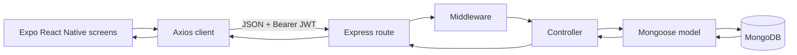

# Architecture

## High-level request lifecycle



1. A screen dispatches an action from `useMoniVoStore`.
2. The action calls the configured Axios instance.
3. Its interceptor reads `userToken` from Expo SecureStore and adds `Authorization: Bearer <token>`.
4. Express applies CORS and body parsing, then matches a mounted route.
5. Protected routes run `protect`, which verifies the JWT and loads `req.user`.
6. The controller validates input, checks ownership and calls a Mongoose model.
7. Mongoose reads or writes MongoDB, and the controller returns JSON.
8. Axios resolves the response and Zustand updates the UI.

## Layer responsibilities

| Layer | Responsibility | Evidence |
|---|---|---|
| Screens/components | Capture input, render data and navigate | `frontend/app`, `frontend/components` |
| Zustand store | Shared auth, transactions, categories, budgets, wallets and theme | `frontend/store/useMoniVoStore.ts` |
| Axios utility | Base URL, timeout and authorization header | `frontend/utils/api.ts` |
| Routes | Map methods and paths to controllers | `backend/src/routes` |
| Middleware | Cross-cutting request processing and errors | `backend/src/middleware` |
| Controllers | Business rules, validation and response codes | `backend/src/controllers` |
| Mongoose models | Schemas, indexes and MongoDB queries | `backend/src/models` |
| MongoDB | Persistent document storage | `MONGODB_URI` |

## What is middleware?

Middleware is an ordered function in the Express pipeline. It receives `(req, res, next)`: it can enrich `req`, reject a request, send a response, or call `next()` so the next function runs.

| Middleware | What it does | Active? |
|---|---|---|
| `cors(...)` | Controls origins, methods and headers; allows native apps/Postman without an origin. | Yes |
| `express.json()` | Parses JSON bodies into `req.body`. | Yes |
| `express.urlencoded({ extended: true })` | Parses URL-encoded form bodies. | Yes |
| `protect` | Requires a Bearer JWT, verifies it and loads the user. | Protected routes |
| `notFound` | Converts unmatched routes into a 404 error. | Yes |
| `errorHandler` | Converts Mongoose and other errors into JSON responses. | Yes |
| Morgan | Development request logging. | No; commented out |

## State management

The app uses Zustand rather than Context API or Redux. `useMoniVoStore` holds user state, loading state, transactions, categories, budgets, wallets and theme. Actions such as `login`, `addTransaction`, `updateTransaction`, `deleteTransaction` and `toggleTheme` update the store; computed functions calculate totals and category spending.

> [ASSUMPTION] Some current CRUD actions use local/dummy data while authentication is connected to the API. Confirm the intended persistence path before claiming every mutation is server-backed.

## JWT authentication flow

```text
Register/Login -> API hashes/checks password -> signs JWT with user id
-> SecureStore saves userToken -> Axios adds Bearer header
-> protect verifies JWT -> User.findById(decoded.id) -> req.user
-> controller reads/writes only that user's records
```

The token is signed proof of identity, not a password. The server still checks ownership in queries, for example by filtering a transaction by both `_id` and `req.user._id`.
